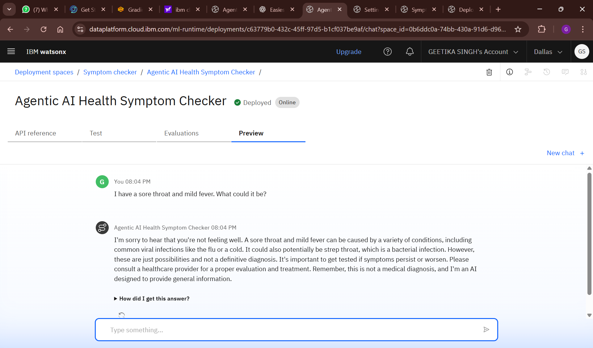

# 🩺 Agentic AI Health Symptom Checker

This project is an AI-powered health assistant built using **IBM Watson Assistant** and **Granite LLM** via no-code tools on **IBM Cloud Lite**. It helps users understand symptoms, get home care advice, and know when to consult a doctor — in a safe, educational manner.

## 🧠 Key Features
* Understands natural language symptom input
* Suggests possible causes, home remedies, and urgency levels
* Does NOT diagnose or prescribe
* Powered by IBM Granite and Watson Assistant
* No-code, lightweight, and user-friendly

## 🚀 How It Works
1. User types a symptom description (e.g., "I have a sore throat")
2. The AI agent responds with:
   - Probable causes (general)
   - Home care tips
   - When to see a doctor

## 🛠️ Tools Used
* IBM Watson Assistant (no-code chatbot flow)
* IBM Granite LLM (via skills/actions)
* IBM Cloud Lite (free hosting tier)

## 📸 Demo

## 📚 References
* [IBM Watson Assistant](https://cloud.ibm.com/catalog/services/watson-assistant)
* [IBM Granite](https://research.ibm.com/blog/granite-foundation-models)
* [WHO Health Info](https://www.who.int/health-topics)

## 🔒 Disclaimer
This tool is for educational purposes only. It does not provide medical diagnosis or treatment.

## 👩‍💻 Author
Geetika Singh – CTAE, Udaipur
